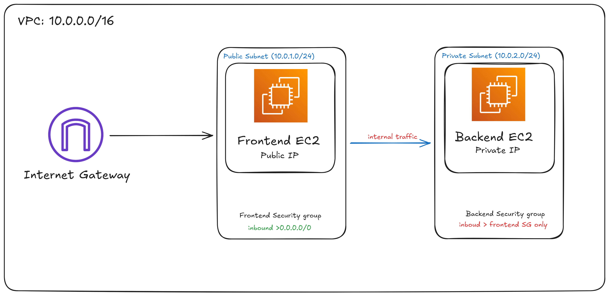
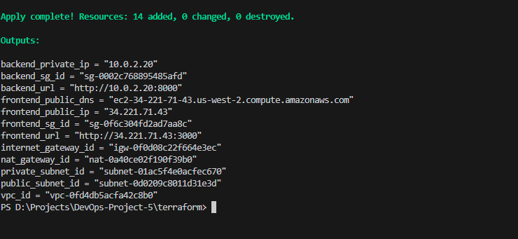

# AWS VPC 2-Tier Architecture with Terraform

> A hands-on DevOps project demonstrating secure AWS networking patterns with Infrastructure as Code

## Description

This project demonstrates the deployment of a secure 2-tier AWS VPC architecture using Terraform. It showcases real-world cloud networking patterns by deploying a Next.js frontend in a public subnet and a FastAPI backend in a private subnet, emphasizing network segmentation, security best practices, and Infrastructure as Code principles.

**Live Demo:** [devops5.himanmanduja.fun](https://devops5.himanmanduja.fun)

## Table of Contents

- [About This Project](#about-this-project)
- [Technologies Used](#technologies-used)
- [Techniques & Concepts](#techniques--concepts)
- [Architecture](#architecture)
- [Prerequisites](#prerequisites)
- [Getting Started](#getting-started)
- [Setup Instructions](#setup-instructions)
- [Infrastructure Components](#infrastructure-components)
- [Verification](#verification)
- [Screenshots/Visual Reference](#screenshotsvisual-reference)
- [Cleanup](#cleanup)
- [License](#license)
- [Author](#author)

## About This Project

This project is built for **learning DevOps and AWS networking** with hands-on, real-world tools and practices. It provides a practical learning experience for:

- Understanding how to build scalable cloud infrastructure from scratch
- Mastering Infrastructure as Code with Terraform
- Implementing production-ready AWS networking architectures
- Learning security best practices in cloud environments
- Automating infrastructure deployment and management

Whether you're new to DevOps or looking to strengthen your AWS and Terraform skills, this project offers a comprehensive, beginner-friendly approach to building secure, scalable infrastructure. Every step is designed to teach core concepts while building something real and functional.

## Technologies Used


- **Terraform** - Infrastructure as Code tool for provisioning AWS resources
- **AWS VPC** - Virtual Private Cloud for isolated network environment
- **AWS EC2** - Elastic Compute Cloud for running application instances
- **AWS NAT Gateway** - Network Address Translation for private subnet internet access
- **AWS Internet Gateway** - Gateway for public subnet internet connectivity
- **AWS Security Groups** - Virtual firewalls for controlling inbound/outbound traffic
- **Next.js** - React framework for the frontend application
- **FastAPI** - Modern Python web framework for the backend API
- **Ubuntu 22.04 LTS** - Operating system for EC2 instances

## Techniques & Concepts

This project demonstrates the following DevOps and Infrastructure as Code techniques:

- **Infrastructure as Code (IaC)** - All infrastructure defined in Terraform configuration files
- **Network Segmentation** - Separating public and private resources using subnets
- **Security Groups** - Implementing least privilege access control at the network level
- **Routing Configuration** - Managing traffic flow with route tables and gateways
- **NAT Gateway Pattern** - Enabling private subnet instances to access the internet securely
- **Automated Provisioning** - Using user_data scripts for EC2 instance configuration
- **State Management** - Tracking infrastructure state with Terraform
- **Resource Tagging** - Organizing and identifying AWS resources
- **CIDR Planning** - Designing IP address spaces for scalability
- **High Availability Design** - Architecture patterns for resilient applications

## Architecture

The infrastructure implements a classic 2-tier VPC architecture pattern, separating the presentation layer (frontend) from the application layer (backend):



### Network Topology

- **VPC CIDR Block:** 10.0.0.0/16 (65,536 IP addresses)
- **Public Subnet:** 10.0.1.0/24 (256 IP addresses)
  - Hosts the frontend Next.js application
  - Direct internet access via Internet Gateway
  - Auto-assigns public IP addresses
- **Private Subnet:** 10.0.2.0/24 (256 IP addresses)
  - Hosts the backend FastAPI application
  - Outbound internet access via NAT Gateway
  - No direct inbound access from the internet

### Traffic Flow

1. **Inbound Traffic:** Internet → Internet Gateway → Public Subnet → Frontend EC2
2. **Internal Traffic:** Frontend EC2 → Private Subnet → Backend EC2
3. **Outbound Traffic:** Private Subnet → NAT Gateway → Internet Gateway → Internet

This architecture ensures that the backend API is never directly exposed to the internet, while still allowing it to download updates and packages through the NAT Gateway.

## Prerequisites

Before deploying this infrastructure, ensure you have the following:

### Required Software

- **Terraform** (v1.0.0 or later)
  ```bash
  # macOS
  brew install terraform
  
  # Linux
  wget https://releases.hashicorp.com/terraform/1.x.x/terraform_1.x.x_linux_amd64.zip
  unzip terraform_1.x.x_linux_amd64.zip
  sudo mv terraform /usr/local/bin/
  
  # Verify installation
  terraform --version
  ```

- **AWS CLI** (v2.0 or later)
  ```bash
  # macOS
  brew install awscli
  
  # Linux
  curl "https://awscli.amazonaws.com/awscli-exe-linux-x86_64.zip" -o "awscliv2.zip"
  unzip awscliv2.zip
  sudo ./aws/install
  
  # Verify installation
  aws --version
  ```

- **Git** - For cloning the repository
  ```bash
  # macOS
  brew install git
  
  # Linux
  sudo apt-get update && sudo apt-get install git
  ```

### AWS Requirements

- **AWS Account** - Create one at [aws.amazon.com](https://aws.amazon.com)
- **IAM User** with the following permissions:
  - VPC management (create/delete VPCs, subnets, route tables)
  - EC2 management (launch/terminate instances)
  - Internet Gateway and NAT Gateway management
  - Security Group management
  - Elastic IP allocation

### AWS Credentials Configuration

Configure your AWS credentials using the AWS CLI:

```bash
aws configure
```

You will be prompted to enter:
- **AWS Access Key ID** - From your IAM user credentials
- **AWS Secret Access Key** - From your IAM user credentials
- **Default region name** - e.g., `us-west-2` (use the same region as in main.tf)
- **Default output format** - `json` (recommended)

> [!IMPORTANT]
> Keep your AWS credentials secure and never commit them to version control.

## Getting Started

Follow these steps to clone and replicate the project:

### 1. Clone the Repository

```bash
git clone https://github.com/HimanM/DevOps-Project-5.git
cd DevOps-Project-5
```

This downloads the complete project including Terraform configurations, application code, and documentation.

### 2. Review the Configuration

Before deploying, review the `terraform/main.tf` file:

```bash
cat terraform/main.tf
```

You may want to customize:
- **AWS region** (default: `us-west-2`) - Change if deploying to a different region
- **VPC CIDR blocks** - Adjust if you need different IP ranges
- **Instance types** (default: `t2.micro`) - Upgrade for better performance
- **AMI IDs** - Ensure they match your target region

> [!NOTE]
> The default configuration uses free-tier eligible resources where possible, but AWS charges may still apply for NAT Gateway and data transfer.

### 3. Navigate to Terraform Directory

```bash
cd terraform
```

All Terraform commands must be run from this directory.

## Setup Instructions

Follow these step-by-step instructions to deploy the infrastructure:

### Step 1: Initialize Terraform

```bash
terraform init
```

**What this does:**
- Downloads the AWS provider plugin
- Initializes the backend for state storage
- Prepares the working directory for Terraform operations
- Creates a `.terraform` directory with necessary files


You should see a message: "Terraform has been successfully initialized!"

### Step 2: Preview the Infrastructure Plan

```bash
terraform plan
```

**What this does:**
- Analyzes your configuration files
- Compares with current state (if any)
- Shows exactly what resources will be created, modified, or destroyed
- Provides a detailed execution plan without making any changes


Review the output carefully. You should see approximately 15-20 resources to be created, including:
- 1 VPC
- 2 Subnets (public and private)
- 1 Internet Gateway
- 1 NAT Gateway
- 1 Elastic IP
- 2 Route Tables
- 2 Route Table Associations
- 2 Security Groups
- Multiple Security Group Rules
- 2 EC2 Instances

### Step 3: Deploy the Infrastructure

```bash
terraform apply
```

**What this does:**
- Shows the execution plan again
- Prompts for confirmation
- Creates all the AWS resources defined in your configuration
- Updates the terraform.tfstate file to track the infrastructure
- Typically takes 2-5 minutes to complete


When prompted, type `yes` and press Enter to confirm the deployment.

> [!TIP]
> You can skip the confirmation prompt by using `terraform apply -auto-approve`, but this is not recommended for production use.

### Step 4: Note the Outputs

After deployment completes, Terraform will display output values including:
- Frontend instance public IP address
- Backend instance private IP address
- VPC ID
- Subnet IDs

Save these values for verification and access to your application.

## Infrastructure Components

### VPC (Virtual Private Cloud)

The VPC provides an isolated network environment with complete control over networking configuration.

**Configuration:**
- **CIDR Block:** 10.0.0.0/16 (provides 65,536 IP addresses)
- **DNS Support:** Enabled (allows instances to resolve DNS names)
- **DNS Hostnames:** Enabled (instances receive public DNS hostnames)
- **Region:** us-west-2

The VPC is the foundation of your network infrastructure, creating a logically isolated section of AWS where you can launch resources.

### Subnets

Subnets divide the VPC into smaller network segments for better organization and security.

#### Public Subnet
- **CIDR Block:** 10.0.1.0/24 (256 IP addresses)
- **Purpose:** Hosts internet-facing resources (frontend application)
- **Auto-assign Public IP:** Enabled
- **Availability Zone:** us-west-2a
- **Internet Access:** Direct via Internet Gateway

#### Private Subnet
- **CIDR Block:** 10.0.2.0/24 (256 IP addresses)
- **Purpose:** Hosts internal resources (backend API)
- **Auto-assign Public IP:** Disabled
- **Availability Zone:** us-west-2a
- **Internet Access:** Outbound only via NAT Gateway

### Gateways

#### Internet Gateway
Enables communication between the VPC and the internet for resources in public subnets.

**Function:**
- Provides a target for internet-routable traffic
- Performs network address translation (NAT) for instances with public IPs
- Allows instances in the public subnet to communicate with the internet

#### NAT Gateway
Allows instances in private subnets to initiate outbound connections to the internet while preventing unsolicited inbound connections.

**Configuration:**
- **Location:** Public subnet
- **Elastic IP:** Associated with a static public IP
- **Purpose:** Enables private subnet instances to download updates and packages
- **Security:** Prevents direct inbound access to private subnet


### Route Tables

Route tables control traffic flow within the VPC and to external networks.

#### Public Route Table
- **Default Route:** 0.0.0.0/0 → Internet Gateway
- **Local Route:** 10.0.0.0/16 → Local (automatic)
- **Association:** Public subnet
- **Traffic Flow:** Enables direct internet access for public subnet

#### Private Route Table
- **Default Route:** 0.0.0.0/0 → NAT Gateway
- **Local Route:** 10.0.0.0/16 → Local (automatic)
- **Association:** Private subnet
- **Traffic Flow:** Routes outbound traffic through NAT Gateway

### Security Groups

Security Groups act as virtual firewalls controlling inbound and outbound traffic at the instance level.

#### Frontend Security Group
- **Inbound Rules:**
  - HTTP (Port 80) from 0.0.0.0/0 - Allows public web access
  - HTTPS (Port 443) from 0.0.0.0/0 - Allows secure web access
  - Custom (Port 3000) from 0.0.0.0/0 - Allows Next.js dev server access
  - SSH (Port 22) from 0.0.0.0/0 - Allows SSH access for management
- **Outbound Rules:** All traffic allowed (enables downloading packages and API calls)


#### Backend Security Group
- **Inbound Rules:**
  - Port 8000 from Frontend Security Group only - Restricts API access to frontend
- **Outbound Rules:** All traffic allowed (enables downloading packages)

This security group configuration ensures the backend is never directly accessible from the internet.

### EC2 Instances

EC2 instances run the application workloads.

#### Frontend Instance
- **AMI:** Ubuntu 22.04 LTS
- **Instance Type:** t2.micro (1 vCPU, 1 GB RAM)
- **Subnet:** Public subnet
- **Public IP:** Auto-assigned by AWS
- **Private IP:** Dynamically assigned from 10.0.1.0/24
- **Application:** Next.js frontend (Port 3000/80)
- **Bootstrap:** Automated via user_data_frontend.sh script


**User Data Script Actions:**
- Updates system packages (`apt-get update`)
- Installs Node.js and npm
- Clones the application repository
- Installs application dependencies (`npm install`)
- Builds the production application (`npm run build`)
- Starts the Next.js server (`npm start`)

#### Backend Instance
- **AMI:** Ubuntu 22.04 LTS
- **Instance Type:** t2.micro (1 vCPU, 1 GB RAM)
- **Subnet:** Private subnet
- **Private IP:** 10.0.2.20 (statically assigned)
- **Public IP:** None (private subnet)
- **Application:** FastAPI backend (Port 8000)
- **Bootstrap:** Automated via user_data_backend.sh script


**User Data Script Actions:**
- Updates system packages (`apt-get update`)
- Installs Python 3 and pip
- Clones the application repository
- Installs FastAPI and dependencies (`pip install`)
- Starts the FastAPI server (`uvicorn main:app`)

## Verification

After successful deployment, follow these steps to verify everything is working correctly:

### Step 1: Check VPC Creation

Navigate to the AWS Console VPC Dashboard:
1. Go to [AWS VPC Console](https://console.aws.amazon.com/vpc/)
2. Verify the VPC is created with CIDR block 10.0.0.0/16
3. Check that two subnets exist (public and private)
4. Verify route tables are properly associated


### Step 2: Verify EC2 Instances

Navigate to the EC2 Dashboard:
1. Go to [AWS EC2 Console](https://console.aws.amazon.com/ec2/)
2. Confirm both instances are running
3. Note the frontend instance public IP address
4. Verify the backend instance only has a private IP

### Step 3: Test Application Access

Access the frontend application:
```
http://<frontend-public-ip>:3000
```

Replace `<frontend-public-ip>` with the actual public IP from the EC2 dashboard.

> [!NOTE]
> It may take 5-10 minutes after deployment for the applications to fully start, as the user_data scripts need to complete installation and configuration.

### Step 4: Verify Backend Connectivity

Use the application's built-in connectivity test feature:
1. Open the frontend application in your browser
2. Navigate to the "Live Connectivity Test" section
3. Click the test button to ping the backend
4. Verify you receive a successful response


A successful response confirms:
- [x] Frontend is running and accessible from the internet
- [x] Backend is running in the private subnet
- [x] Network routing between subnets works correctly
- [x] Security groups are properly configured
- [x] NAT Gateway is functioning for outbound traffic

### Step 5: Verify Security Configuration

Check the security groups:
1. Navigate to EC2 → Security Groups
2. Verify frontend security group allows inbound HTTP/HTTPS
3. Verify backend security group only allows traffic from frontend

### Troubleshooting

If verification fails:

**Frontend not accessible:**
- Check security group allows inbound traffic on port 3000
- Verify instance is in a public subnet with Internet Gateway route
- Check user_data script logs: `ssh ubuntu@<public-ip>` then `cat /var/log/cloud-init-output.log`

**Backend connectivity fails:**
- Verify backend security group allows inbound port 8000 from frontend
- Check backend is running: SSH to frontend, then `curl http://10.0.2.20:8000`
- Verify NAT Gateway is properly configured and has an Elastic IP

## Screenshots/Visual Reference

This section includes all visual references for the project, showing the deployment process and AWS infrastructure:

### Architecture Diagram


The complete 2-tier VPC architecture showing all components and their relationships.

### AWS Infrastructure Components

#### VPC Configuration


Shows the VPC with proper CIDR block, DNS settings, and overall network structure.


Network interfaces attached to the VPC showing ENIs for EC2 instances and NAT Gateway.

#### NAT Gateway


The NAT Gateway configuration in the public subnet enabling private subnet internet access.

#### Security Groups


Security group configurations showing inbound/outbound rules for frontend and backend.

#### EC2 Instances


Overview of both EC2 instances running in their respective subnets.


Details of the frontend instance in the public subnet with its public IP address.

### Terraform Deployment Process

#### Step 1: Terraform Init


Initialization process showing provider plugin download and backend setup.

#### Step 2: Terraform Plan


Execution plan showing all resources to be created.

#### Step 3: Terraform Apply


Deployment in progress, creating AWS infrastructure resources.


Confirmation prompt during terraform apply, showing the resource changes to be made.

### Application Verification


The frontend application successfully communicating with the backend API, confirming all networking is properly configured.



Additional verification showing successful deployment and application functionality.

## Cleanup

To avoid ongoing AWS charges, destroy the infrastructure when you're done:

> [!WARNING]
> This will permanently delete all resources. Ensure you've backed up any important data before proceeding.

### Step 1: Navigate to Terraform Directory

```bash
cd terraform
```

### Step 2: Run Terraform Destroy

```bash
terraform destroy
```

**What this does:**
- Shows a plan of all resources to be destroyed
- Prompts for confirmation
- Deletes resources in the correct order (respecting dependencies)
- Updates the state file to reflect the destroyed infrastructure

### Step 3: Confirm Destruction

When prompted, type `yes` and press Enter.

### Resources That Will Be Deleted:

The destroy process will remove resources in this order:
1. **EC2 Instances** - Frontend and backend instances terminated
2. **NAT Gateway** - NAT Gateway deleted and Elastic IP released
3. **Route Table Associations** - Subnet associations removed
4. **Route Tables** - Custom route tables deleted
5. **Internet Gateway** - Detached and deleted
6. **Security Groups** - Custom security groups removed
7. **Subnets** - Public and private subnets deleted
8. **VPC** - The VPC and all associated resources removed

### Destruction Time

The process typically takes 2-3 minutes. The NAT Gateway may take the longest to delete.

### Verify Cleanup

After destruction completes:
1. Check the AWS VPC Console to confirm the VPC is gone
2. Check the EC2 Console to verify instances are terminated
3. Verify no Elastic IPs remain allocated
4. Confirm the local `terraform.tfstate` file shows no resources

> [!TIP]
> You can skip the confirmation prompt with `terraform destroy -auto-approve`, but use caution as this provides no opportunity to review what will be deleted.

### Cost Considerations

Even after destroying resources, note:
- **Elastic IPs** - If not released, they incur charges
- **Snapshots** - If you created any snapshots, they must be deleted separately
- **S3 Buckets** - If you stored logs or data, delete buckets separately
- **CloudWatch Logs** - May retain logs that incur storage costs

## License

This is an **educational project** created for learning DevOps and AWS networking concepts.

### Usage Terms

This project is completely open for educational use. You are free to:
- Fork this repository
- Modify and adapt the code
- Use it for personal learning
- Share it with others learning DevOps
- Create derivative works
- Use it in educational settings

**No restrictions.** If you learn something from this project or build upon it, that's exactly what it's meant for. Educational use, modification, and sharing are all encouraged.

### Attribution

While not required, attribution is appreciated if you use this project as a foundation for your own work.

## Author

**Himan Manduja**

- **GitHub:** [@HimanM](https://github.com/HimanM)
- **Project Series:** DevOps Learning Series - Project 5
- **Focus:** AWS VPC 2-Tier Architecture with Terraform

### About This Project

This project is part of a DevOps learning series focused on building real-world cloud infrastructure skills. It demonstrates practical implementation of AWS networking concepts, Infrastructure as Code principles, and modern DevOps practices.

### Contact & Feedback

For questions, feedback, or issues:
- **Open an Issue:** Use the [GitHub Issues](https://github.com/HimanM/DevOps-Project-5/issues) page
- **Discussions:** Join the conversation in [GitHub Discussions](https://github.com/HimanM/DevOps-Project-5/discussions)
- **Pull Requests:** Contributions and improvements are welcome!

### Connect

If this project helped you learn something new, consider:
- Giving it a star on GitHub
- Sharing it with others learning DevOps
- Contributing improvements or fixes
- Providing feedback on what could be better

---

> **Note:** This project is actively maintained as part of a DevOps learning portfolio. Updates and improvements are made regularly based on user feedback and evolving best practices.
